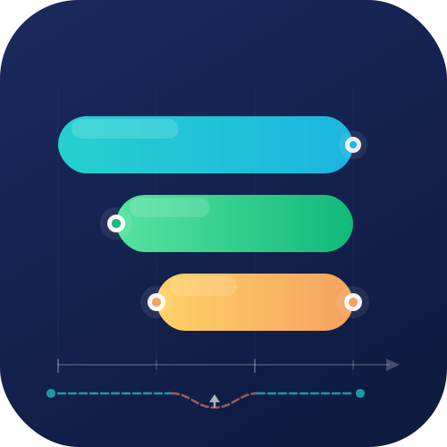

<p align="center">
  
</p>

<h1 align="center">Declarative State</h1>

<p align="center">
  A Home Assistant integration for declaring what state an entity <em>should</em> be in — and keeping it there.
</p>

<p align="center">
  <a href="https://github.com/cwrau/declarative-state/releases"></a>
  <a href="https://hacs.xyz"></a>
  <a href="https://www.home-assistant.io/"></a>
  <a href="LICENSE"></a>
</p>

---

## What it does

**Declarative State** lets you write time- and condition-based rules that describe what state something *should* be in at any given moment. The integration evaluates those rules continuously and — optionally — enforces them by calling services on a target entity whenever the desired state changes or the actual state drifts away.

Think of it as a programmable schedule that also acts as a watchdog.

```
┌─ Rule 1  ────────────────────────────────────────────┐  state: "on"
└──────────────────────────────────────────────────────┘
         ┌─ Rule 2 (conditional) ────────────────────────┐  state: "off"
         └──────────────────────────────────────────────┘
                  ┌─ Rule 3 ──────────────┐               state: "on"
                  └───────────────────────┘
──────────────────────────────────────────────────────►  time
```

Rules are evaluated by priority (last rule wins). The resulting state is exposed as a sensor entity and, when a target entity is configured, applied automatically.

---

## Features

- **Declarative rules** — combine time windows, seasonal dates, and conditions in a prioritised list; the last matching rule wins
- **Rich time formats** — `HH:MM`, `*-MM-DD` annual dates, full ISO 8601 with wildcards, or Jinja2 templates (e.g. sunrise/sunset)
- **Full HA condition support** — any native Home Assistant condition (`state`, `numeric_state`, `template`, `and`/`or`/`not`, etc.)
- **`for` duration support** — conditions can require an entity to have been in a state for a minimum duration before the rule activates
- **Target entity control** — automatically call services on an entity, area, device, or label when the calculated state changes
- **Per-state actions** — define different service calls for each state value; fall back to a generic action for unspecified states
- **Drift detection & auto-correction** — if the target entity is changed externally, the integration detects the drift and re-applies the correct state
- **Sync attribute** — watch a specific attribute instead of entity state for drift comparison
- **Lookahead** — pre-calculate up to 10 upcoming state transitions and expose them as sensor attributes
- **Target-only mode** — skip creating a sensor entity and use the integration purely to control another entity
- **UI configuration** — fully configurable from the Home Assistant UI; no YAML required

---

## Installation

### Via HACS (recommended)

1. Open HACS → **Integrations**
2. Click the ⋮ menu → **Custom repositories**
3. Add `https://github.com/cwrau/declarative-state` as an **Integration**
4. Search for **Declarative State** and install it
5. Restart Home Assistant

### Manual

1. Copy the `custom_components/declarative_state` directory into your HA `config/custom_components/` folder
2. Restart Home Assistant

---

## Quick start

After installation, go to **Settings → Devices & services → Add integration** and search for **Declarative State**.

The setup wizard walks you through:

1. **Name** — gives the integration instance a name (e.g. `Office Lights`)
2. **Manage States** — add the time/condition rules
3. **Target Entity** *(optional)* — pick the entity to control
4. **Generic Action** / **Per-state Actions** *(optional)* — configure the service calls
5. **General Settings** *(optional)* — tune lookahead, error handling, target-only mode
6. **Done**

Multiple independent instances can be created — one per "thing" you want to schedule.

---

## State rules

Each rule in the **states** list has:

| Field | Required | Description |
|---|---|---|
| `state` | yes | The state value this rule produces (any string, e.g. `"on"`, `"off"`, `"200"`) |
| `start` | no | When the rule's window opens (see [Time formats](#time-formats)) |
| `end` | no | When the rule's window closes |
| `conditions` | no | One or more HA conditions that must all be true |

If neither `start` nor `end` is set the rule is always-active (a useful default/fallback).

### Priority

Rules are evaluated **bottom-up** — the last rule in the list has the highest priority. When two rules cover the same moment, the lower one (higher index) wins. This lets you build schedules like:

```
- state: "off"           # fallback — always off …
- state: "on"            # … except 08:00–22:00 …
  start: "08:00"
  end: "22:00"
- state: "off"           # … and forced off after midnight if someone is asleep
  start: "00:00"
  end: "06:00"
  conditions:
    - condition: state
      entity_id: input_boolean.sleeping
      state: "on"
```

---

## Time formats

| Format | Example | Meaning |
|---|---|---|
| `HH:MM` | `"08:30"` | Daily at 08:30 |
| `HH` | `"22"` | Daily at 22:00 |
| `*-MM-DD` | `"*-12-24"` | Every year on Dec 24 at midnight |
| `*-MM-DDThh:mm` | `"*-12-24T17:00"` | Every year on Dec 24 at 17:00 |
| `YYYY-MM-DD` | `"2025-06-01"` | A specific date at midnight |
| Jinja2 template | `"{{ state_attr('sun.sun', 'next_dusk') }}"` | Dynamic time from a template |

Annual dates with `*` wildcards are the most flexible — they work across year boundaries (e.g. `start: "*-12-01"` / `end: "*-01-15"` correctly spans New Year).

---

## Conditions and `for` durations

Any [Home Assistant condition](https://www.home-assistant.io/docs/scripts/conditions/) works in the `conditions` list. Multiple conditions are ANDed together.

```yaml
conditions:
  - condition: or
    conditions:
      - condition: state
        entity_id: media_player.living_room_tv
        state: "on"
      - condition: state
        entity_id: media_player.living_room_tv
        state: "on"
        for:
          minutes: 5    # must have been on for at least 5 minutes
```

When a `for` duration is present the integration automatically schedules a re-evaluation at the exact moment the duration expires, so the state transition happens on time without waiting for the next periodic refresh.

---

## Target entity control

Configure a target entity to have the integration automatically call services whenever the calculated state changes.

### Generic action

A single service used as the default for any state value:

```yaml
target:
  entity_id: switch.office_lights
action: switch.turn_on       # for state "on"
```

Use `{{ state }}` in the action data to pass the calculated state value dynamically:

```yaml
action: light.turn_on
data:
  brightness_pct: "{{ state }}"
```

### Per-state actions

Different services for different state values:

| State value | Service called |
|---|---|
| `"on"` | `light.turn_on` |
| `"off"` | `light.turn_off` |
| `"dim"` | `light.turn_on` with `brightness_pct: 20` |

States without a per-state action fall back to the generic action automatically.

### Expected state

Each action can declare what the target entity should report after it's applied. The integration uses this to detect drift:

```yaml
expected_state: "on"
```

Leave it empty to use the calculated state value as-is.

### Drift detection and auto-correction

When **Keep in sync** is enabled (the default), the integration watches the target entity for state changes. If the entity's state diverges from the expected state — for example because someone toggled it manually — the integration detects this and re-applies the correct action automatically.

A **2-second debounce** prevents the integration's own service calls from triggering false drift corrections.

#### Sync attribute

By default, drift is detected by comparing the entity's **state**. Set *Sync Attribute* to watch a specific attribute instead — useful for brightness, volume level, or any numeric attribute.

### Target-only mode

Enable **Target-only mode** to suppress the sensor entity entirely. Use this when you only need to control something on a schedule and don't want an extra sensor cluttering your entity registry.

---

## Lookahead

Set **Lookahead** to a number greater than zero to pre-calculate upcoming state transitions. Each future transition is exposed as an attribute on the main sensor:

| Lookahead | Entities created | Attributes |
|---|---|---|
| `0` | `sensor.name` | `start`, `end` |
| `1` | `sensor.name`, `sensor.name_next` | as above on each |
| `2` | + `sensor.name_3_next` | |
| `N` | + `sensor.name_N+1_next` | |

Each sensor reports its `start` and `end` as full ISO 8601 datetimes, plus `start_time` / `end_time` (HH:MM) when the boundary falls on the current day.

---

## Error handling

| Mode | Behaviour |
|---|---|
| `ignore` *(default)* | Skip any rule that fails to evaluate; continue with the remaining rules |
| `unavailable` | Mark the sensor unavailable if any rule evaluation fails |

Errors are always written to the Home Assistant log regardless of mode.

---

## YAML configuration

UI configuration is recommended, but YAML is also supported via the `sensor` platform:

```yaml
sensor:
  - platform: declarative_state
    name: "christmas_lights"
    lookahead: 1
    error_handling: ignore
    states:
      - state: "on"
        start: "*-12-01T16:00"
        end: "*-01-06T23:00"
      - state: "on"
        start: "16:00"
        end: "23:00"
        conditions:
          - condition: state
            entity_id: input_boolean.holiday_mode
            state: "on"
      - state: "off"
        start: "23:00"
        end: "07:00"
    target:
      entity_id: light.christmas_tree
      sync: true
      action: light.turn_on
      actions:
        "off":
          action: light.turn_off
```

---

## Examples

### Simple on/off schedule

```yaml
sensor:
  - platform: declarative_state
    name: office_fan
    states:
      - state: "off"
      - state: "on"
        start: "08:00"
        end: "18:00"
```

### Sun-based schedule

```yaml
sensor:
  - platform: declarative_state
    name: porch_light
    states:
      - state: "off"
      - state: "on"
        start: "{{ state_attr('sun.sun', 'next_dusk') }}"
        end: "{{ state_attr('sun.sun', 'next_dawn') }}"
```

### Seasonal heating schedule with presence

```yaml
sensor:
  - platform: declarative_state
    name: heating_mode
    states:
      - state: "eco"                  # always-on fallback
      - state: "comfort"
        start: "06:30"
        end: "22:00"
        conditions:
          - condition: state
            entity_id: person.alice
            state: home
      - state: "off"                  # high priority: summer override
        start: "*-06-01"
        end: "*-09-01"
```

---

## Troubleshooting

**Sensor is unavailable**
- Check the Home Assistant log for errors referencing `declarative_state`
- Confirm that condition entity IDs exist and are correctly spelled
- Switch `error_handling` to `unavailable` temporarily — it will surface the first failing rule

**State doesn't change at the expected time**
- The integration updates every minute by default; the transition may be up to 60 seconds late
- For near-instant transitions on condition changes, ensure the relevant entities are being tracked (they are discovered automatically)
- For `for`-duration conditions the re-evaluation is scheduled precisely; check the log for `"Scheduling for-condition refresh"` messages

**Target entity keeps getting reset**
- Drift correction is enabled — the integration will override manual changes to keep the entity in sync
- Disable **Keep in sync** if you want manual control to persist

**`for` conditions don't seem to work**
- Ensure the time format is a valid HA duration: `{seconds: 8}`, `{minutes: 1}`, or `"0:00:08"`
- Check the log for `"Scheduling for-condition refresh"` to confirm the timer is being registered

---

## Contributing

Bug reports and pull requests are welcome on [GitHub](https://github.com/cwrau/declarative-state/issues).

---

## License

AGPL-3.0 — see [LICENSE](LICENSE).
